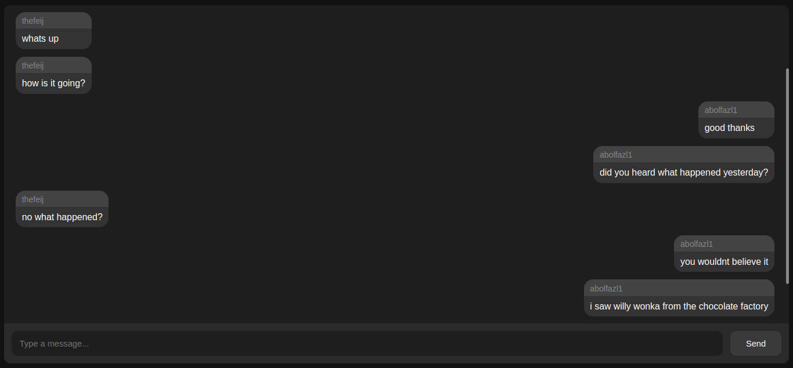
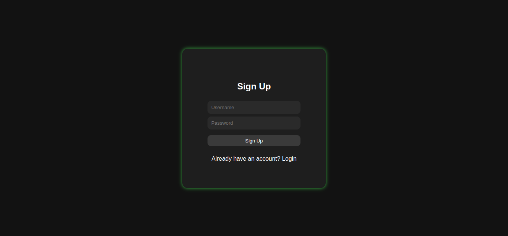
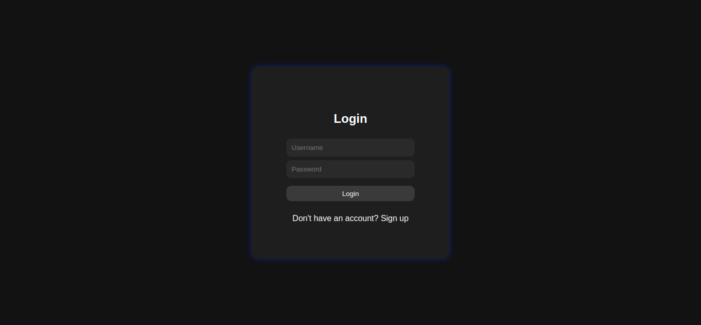

# Chat Hub

A chat server developed with Golang.

Signup and chat with other people in the hub!

Website: https://chat-hub.liara.run

## Table of Contents

- [Introduction](#introduction)
- [Features](#features)
- [Usage](#usage)
- [API Endpoints](#api-endpoints)

## Introduction

This project is a chat server developed with golang. Users can sign up
in the server and join the chat server where they will be able to chat with 
other people in the hub. Chats are stored in the server so messages will remain
in the chat and users are able to see previous messages

## Features

This project uses

- [Gin](https://github.com/gin-gonic/gin) as its HTTP web framework to develop REST APIs
- [GORM](https://gorm.io/) as its ORM to interact with the database
- [Postgresql](https://www.postgresql.org/) as the database
- [Gorilla websocket](https://github.com/gorilla/websocket) package to handle websocket connections
- [Docker](https://www.docker.com/) to create docker image of the app
- [PASETO](https://paseto.io/) tokens to handle Authorization logic

## Usage

### Sign Up
Choose a username and password and sign up!

### Login
If you already have an account, enter your username and password and log in!

### Chat
After a Successful login or signup now you can chat with other people in the hub!

## API Endpoints
- POST /api/signup ---> signup a new user.
- POST /api/login ---> login user.
- POST /api/refresh ---> refresh access token.
- GET /api/chat ---> start a websocket connection with the server